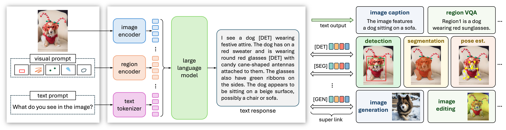

<h1> VisionLLM Series </h1>

- [VisionLLM](https://arxiv.org/abs/2305.11175): Large Language Model as Open-Ended Decoder for Vision-Centric Tasks (NIPS2023)
- [VisionLLM v2](https://arxiv.org/abs/2406.08394): A Generalist Multimodal Large Language Model for Hundeds of Vision-Language Tasks (NIPS2024)

 

## 🚀 News
- `2024/06`: We release VisionLLM v2, which is a generalist multimodal large language model to support hundres of vision-language tasks, covering visual understanding, perception and generation.
