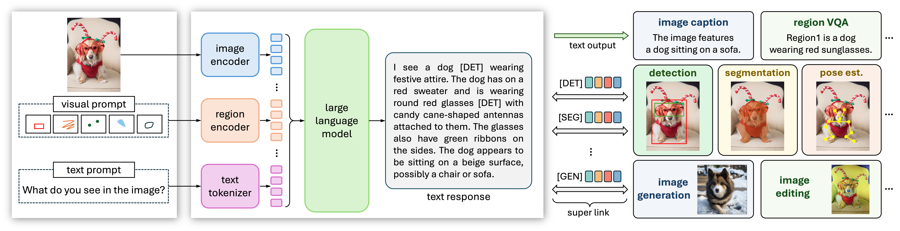
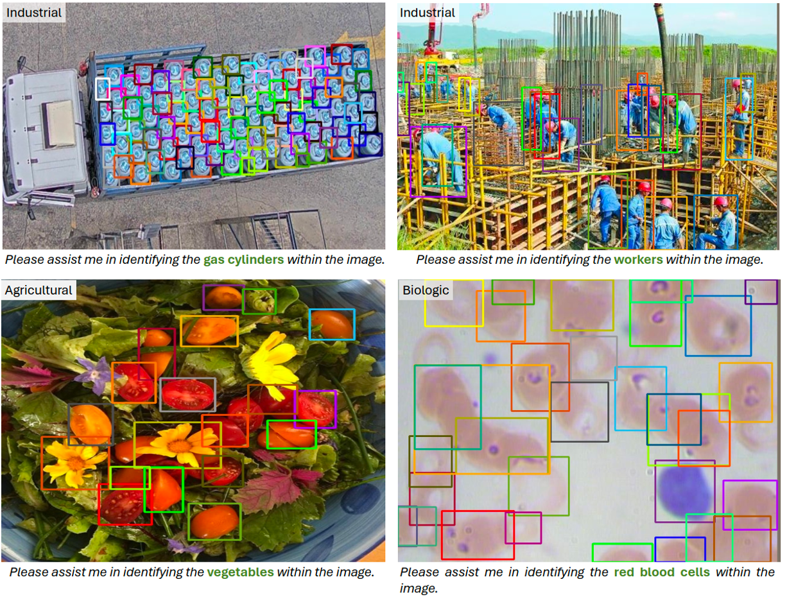

# VisionLLM v2: An End-to-End Generalist Multimodal Large Language Model for Hundreds of Vision-Language Tasks

<div align="center">

[](https://arxiv.org/abs/2406.08394)&nbsp;
[](https://wjn922.github.io/visionllmv2.github.io/)&nbsp;

</div>

## 🏠 Overview



We present VisionLLM v2, an end-to-end generalist multimodal large model (MLLM) that unifies visual perception, understanding, and generation within a single framework. Unlike traditional MLLMs limited to text output, VisionLLM v2 significantly broadens its application scope. It excels not only in conventional visual question answering (VQA) but also in open-ended, cross-domain vision tasks such as object localization, pose estimation, and image generation and editing.


## ✨ Highlights


VisionLLM v2 
- supports using <b>textual, visual and in-context instructions</b> to accomplish <b>hundreds of vision-language tasks</b>, including mutlimodal conversation, object detection, instance segmentation, interactive segmentation, pose estimation, image generation and editing, *etc*. 
- shows strong generalization across <b>multiple domains</b> such as industry, medical and remote-sensing images. 
- achieves <b>comparable performance</b> with expert models on various standard benchmarks.

### Quantative Results

- <b>Object Detection and Instance Segmentation</b>


- <b>Pose Estimation</b>


### Qualitative Results

- <b>Visual Perception</b>




- <b>Visual Generation</b>


## 🚩 Model Zoo

In the following table, we provide the link for VisionLLMv2.

|   Model Name    |                                       Vision Part                                       |                                 Language Part                                  |                           HF Link                           |  size |
| :-------------: | :-------------------------------------------------------------------------------------: | :----------------------------------------------------------------------------: | :---------------------------------------------------------: | :----: |
| VisionLLMv2  | [clip-vit-large](https://huggingface.co/openai/clip-vit-large-patch14) |   [vicuna-7b-v1.5](https://huggingface.co/lmsys/vicuna-7b-v1.5)   | [🤗 link](https://huggingface.co/OpenGVLab/VisionLLMv2)  |  7B |

Please follow the [model preparation](docs/model.md) to prepare the model.


## 📕 Documents

- **Installation**: [Installation Guide](docs/install.md)
- **Evaluation Data Preparation**: [Image-Level VQA](docs/data_image-vqa.md) | [Region-Level VQA](docs/data_region-vqa.md) | [Object Detection](docs/data_det.md) | [Pose Estimation](docs/data_pose.md)
- **Evaluation**: [Image-Level VQA](docs/eval_image-vqa.md) | [Region-Level VQA](docs/eval_region-vqa.md) | [Object Detection](docs/eval_det.md) | [Pose Estimation](docs/eval_pose.md)

## 🗓️ Schedule 

- [ ] Add Hugging Face Demo
- [x] Release Training Code
- [x] Release Model Checkpoints
- [x] Release Evaluation Code
- [x] Release Model Code

## 🎫 License

This project is released under the [Apache 2.0 license](LICENSE). 

## 🖊️ Citation

If you find this project useful in your research, please consider cite:

```BibTeX

@article{wu2024visionllmv2,
  title={VisionLLM v2: An End-to-End Generalist Multimodal Large Language Model for Hundreds of Vision-Language Tasks},
  author={Jiannan, Wu and Muyan, Zhong and Sen, Xing and Zeqiang, Lai and Zhaoyang, Liu and Zhe, Chen and Wenhai, Wang and Xizhou, Zhu and Lewei, Lu and Tong, Lu and Ping, Luo and Yu, Qiao and Jifeng, Dai},
  journal={arXiv preprint arXiv:2406.08394},
  year={2024}
}

```

## Acknowledgement

VisionLLMv2 is built with reference to the code of the following projects: [LLaVA](https://github.com/haotian-liu/LLaVA), [InternVL](https://github.com/OpenGVLab/InternVL), [Grounding DINO](https://github.com/IDEA-Research/GroundingDINO), [UniPose](https://github.com/IDEA-Research/UniPose), [Transformers](https://github.com/huggingface/transformers), and [Diffusers](https://github.com/huggingface/diffusers). Thanks for their wonderful work!
